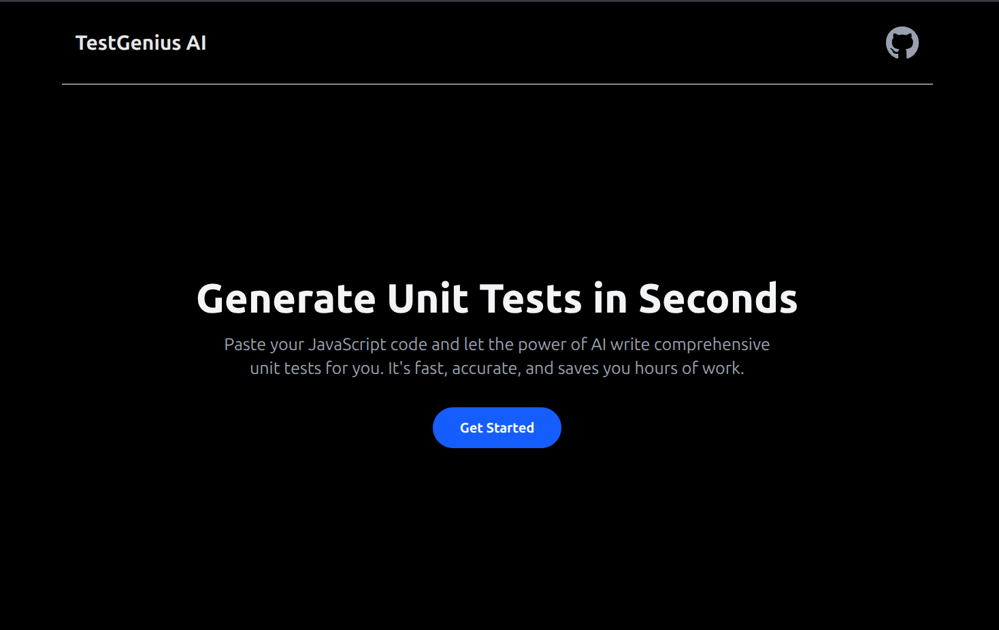
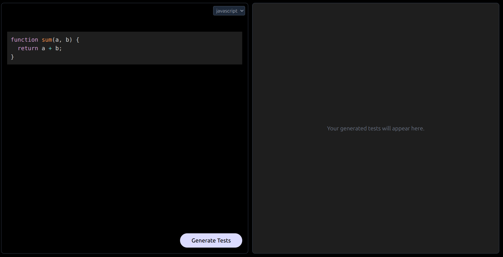

# TestGenius AI
## AI-Powered Unit Test Generation

TestGenius AI is a web application that uses the power of Google's Gemini API to automatically generate comprehensive unit tests for your JavaScript code. Simply paste your code into the editor and receive a ready-to-use test suite, helping you save time and ensure code quality.

## Features
  - AI-Powered Test Generation: Get instant, well-structured unit tests for your JavaScript functions.
  - Vitest/Jest Framework Support: The AI generates tests using a modern, fast, and reliable testing framework.
  - Real-time Code Editor: A clean, responsive code editor with syntax highlighting.

  

## Tech Stack

`Node.js` `Express.js` `TypeScript` `Gemini` `AI` `React`

